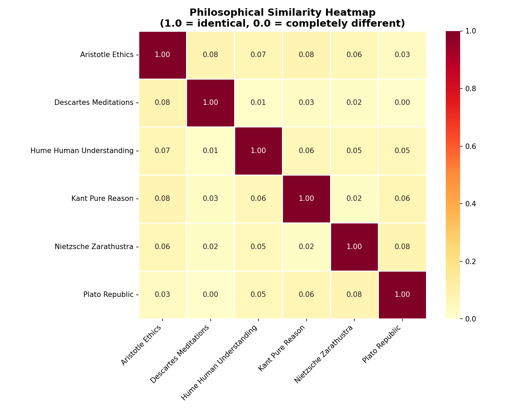
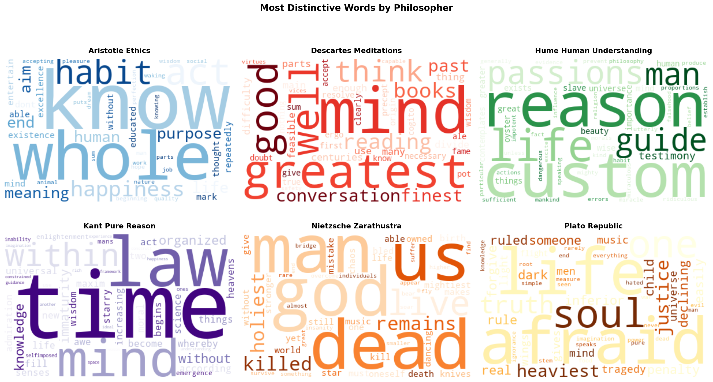
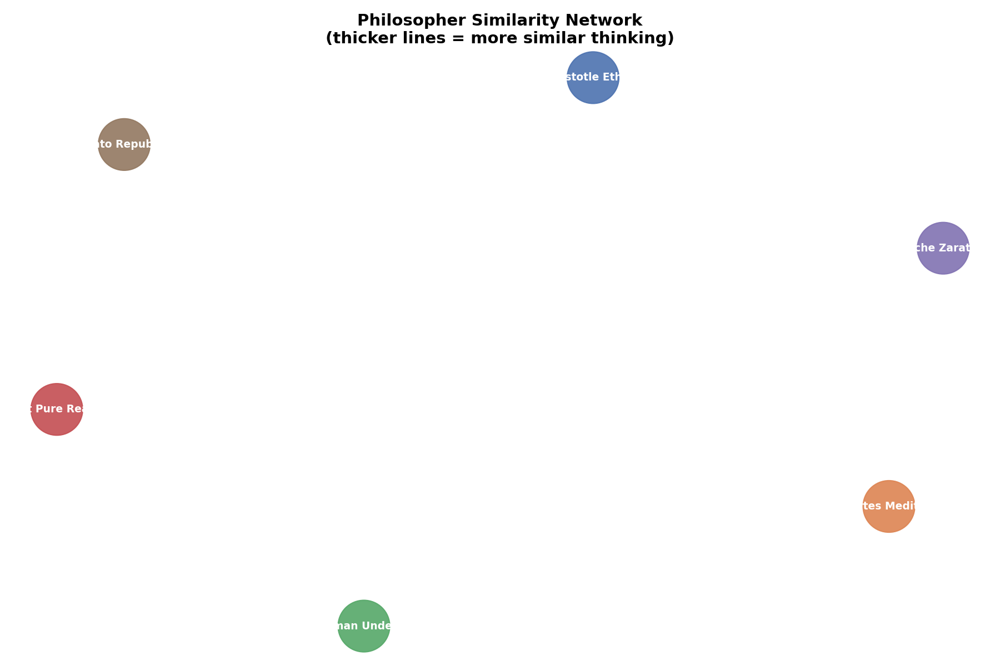

# Philosopher Similarity Analysis

## Overview
An NLP project that analyzes the writing of 6 famous philosophers to answer:
**Which philosophers think most alike?**

Philosophers analyzed: Plato, Nietzsche, Kant, Aristotle, Descartes, Hume

## Key Findings
- Text was vectorized using TF-IDF to capture each philosopher's unique vocabulary
- Cosine similarity was used to measure how alike each pair of philosophers writes
- Results visualized through heatmaps, word clouds, and a network graph

## Tech Stack
- Python, Jupyter Notebook
- NLTK (text cleaning)
- Scikit-learn (TF-IDF, cosine similarity)
- Matplotlib, Seaborn (visualizations)
- WordCloud, NetworkX (network graph)

## Visualizations
### Similarity Heatmap

### Word Clouds

### Philosopher Network Graph

## How to Run
1. Clone this repository
2. Install dependencies:
pip install nltk scikit-learn matplotlib seaborn wordcloud networkx
3. Open the notebook in Jupyter and run cells in order

## Author
Built as part of my Data Science portfolio - Year 1 student exploring NLP and text analysis.
